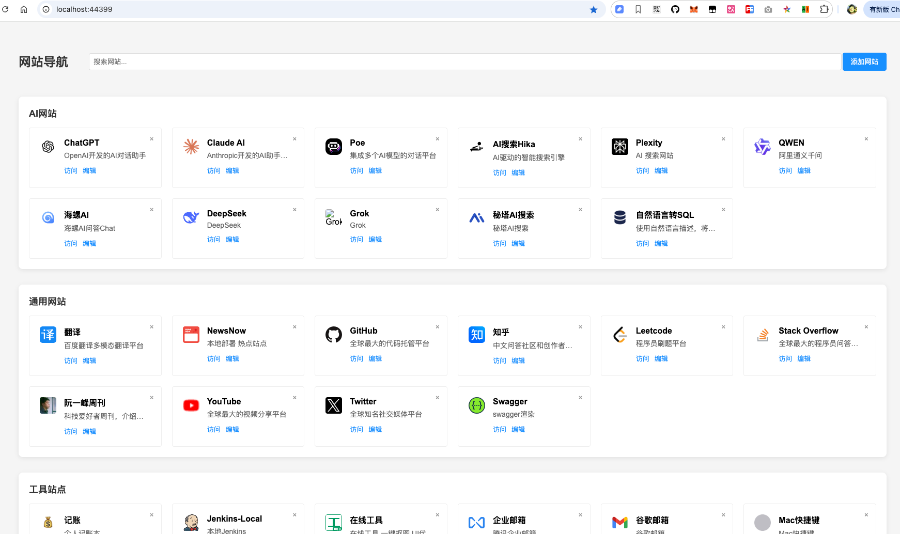

# 站点导航系统

## 项目介绍
站点导航系统是一个用于管理和快速访问各类网站的工具。它提供了一个直观的界面，让用户可以方便地管理、分类和访问常用的网站链接。

## 功能特性
- 站点分类管理：支持通用网站、开发网站、测试网站和生产网站四大类
- 站点排序：可通过排序值调整站点显示顺序，数值越大排序越靠前
- 拖拽排序：支持直接拖拽调整站点顺序
- Host配置：支持为站点配置Host映射
- 站点搜索：支持按名称和描述搜索站点
- 一键复制Host：快速复制站点的Host配置

## 效果展示


## 部署指南

### Docker部署
1. 克隆代码仓库
```bash
git clone [仓库地址]
cd site-navigation
```

2. 使用Docker Compose部署
```bash
docker-compose up -d
```

### 手动部署
1. 安装Go环境(1.16+)

2. 克隆代码并编译
```bash
git clone [仓库地址]
cd site-navigation
go build
```

3. 运行程序
```bash
./site-navigation
```

默认服务将在 http://localhost:8080 启动

## 使用说明

### 添加站点
1. 点击右上角的「添加」按钮
2. 填写站点信息：
   - 名称：站点名称
   - URL：站点访问地址
   - 描述：站点描述信息
   - 模块：选择站点分类（通用/开发/测试/生产）
   - 图标：站点图标URL或表情符号
   - Host配置：可选，每行一个Host配置
   - 排序值：控制站点显示顺序，数值越大越靠前

### 编辑站点
1. 点击站点卡片上的「编辑」按钮
2. 修改相关信息
3. 点击「确定」保存更改

### 删除站点
点击站点卡片右上角的删除按钮即可删除站点

### 站点排序
- 方式一：设置排序值，数值越大排序越靠前
- 方式二：直接拖拽站点卡片调整顺序

### Host配置
1. 在添加或编辑站点时，可以在Host配置框中添加Host映射
2. 每行一个Host配置，格式：`IP地址 域名`
3. 点击站点卡片上的「复制Host」可快速复制配置

### 站点搜索
在顶部搜索框中输入关键词，可按站点名称和描述进行搜索

## 开发指南

### 项目结构
```
.
├── main.go        # 主程序入口
├── models.go      # 数据模型
├── sites.json     # 站点数据存储文件
├── static/        # 静态资源
│   ├── css/      # 样式文件
│   └── js/       # JavaScript文件
└── templates/     # HTML模板
```

### 技术栈
- 后端：Go
- 前端：HTML + CSS + JavaScript
- 数据存储：JSON文件

### 本地开发
1. 克隆代码
```bash
git clone [仓库地址]
cd site-navigation
```

2. 安装依赖
```bash
go mod download
```

3. 运行开发服务器
```bash
go run .
```

4. 访问 http://localhost:8080 进行开发和调试

### 构建部署
1. 构建二进制文件
```bash
go build
```

2. 构建Docker镜像
```bash
docker build -t site-navigation .
```